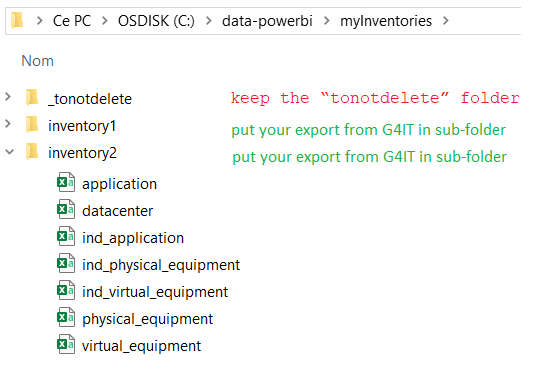
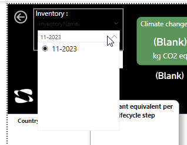

# Green IT Power Bi
Explore the impact of my inventories with Power BI to improve my analysis and find actions to reduce my impact.
A Power Bi application using Power Bi desktop, CSV files and a custom theme. 

## Prerequisites
- You need to install Power Bi Desktop [Here](https://powerbi.microsoft.com/fr-fr/downloads/) 
- Download the theme and csv files in the project
- Store them on the folder C:\data-powerbi of your computer

## Getting started

### Step 1 - Launch G4IT Power bi
- Open the G4IT_PowerBi.pbix in Power Bi Desktop 
- ⚠ Important: If an error occur while trying to initialize the project, you have to change the path of the csv files.
 
### Step 2 - Export yours inventories
- On G4IT, in the Information System module, go on the equipment view or the application view of your inventory
- Click on Export button (G4IT prepare the export)
- Click on Download button
- Unzip and save the files in the folder C:\data-powerbi instead of the example files and keep the “tonotdelete” folder

### Step 3 - Update Power bi
- On Power Bi, click on the Refresh button
- Your inventory is now displayed on the Inventory slicer

- 
### Step 4 - Explore and Analyze !!

* Note : to implement the custom theme: In the View tab, next to the suggested design, click on the arrow. 
Then click on “Browse for themes” and select “G4IT_theme” file.*